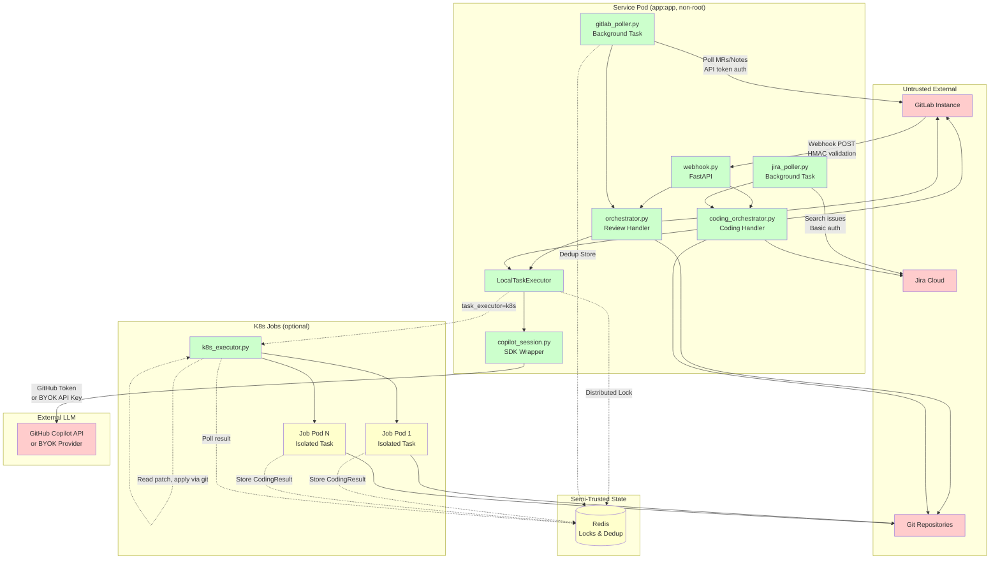

# Architecture Overview

## System Architecture



## Component Layers

### 1. HTTP Ingestion Layer
- **`webhook.py`**: FastAPI endpoints for GitLab webhooks (merge_request, note)
- **`gitlab_poller.py`**: Background poller for MR discovery and `/copilot` notes
- **`jira_poller.py`**: Background poller for issues in "AI Ready" status

### 2. Processing Layer
- **`orchestrator.py`**: MR review orchestration (clone → review → parse → post)
- **`mr_comment_handler.py`**: `/copilot` command processing (clone → code → apply result → commit → push)
- **`coding_orchestrator.py`**: Jira issue implementation (clone → code → apply result → branch → MR)
- **`coding_workflow.py`**: Shared helper for applying coding results (diff passback from k8s pods)
- **`review_engine.py`**: Review prompt construction and execution
- **`coding_engine.py`**: Coding task prompt construction and .gitignore hygiene
- **`prompt_defaults.py`**: Canonical system prompt defaults and `get_prompt()` resolver

### 3. Execution Layer
- **`task_executor.py`**: TaskExecutor protocol + LocalTaskExecutor
- **`k8s_executor.py`**: KubernetesTaskExecutor (Job creation, result polling)
- **`copilot_session.py`**: Copilot SDK wrapper (client init, session config, result extraction)
- **`task_runner.py`**: K8s Job entrypoint (`python -m gitlab_copilot_agent.task_runner`)

### 4. External Service Clients
- **`gitlab_client.py`**: GitLab REST API (MR details, comments, clone, create MR)
- **`jira_client.py`**: Jira REST API v3 (search, transitions, comments)

### 5. Shared Utilities
- **`git_operations.py`**: Git CLI wrappers (clone, branch, commit, push)
- **`comment_parser.py`**: Extract structured review from agent output
- **`comment_poster.py`**: Post inline discussions to GitLab MR
- **`repo_config.py`**: Discover repo-level skills, agents, instructions

### 6. State & Concurrency
- **`concurrency.py`**: MemoryLock, MemoryDedup, ReviewedMRTracker, ProcessedIssueTracker
- **`redis_state.py`**: RedisLock, RedisDedup (Redlock-style distributed locking)

### 7. Telemetry
- **`telemetry.py`**: OTEL tracing, metrics, log export
- **`metrics.py`**: All 7 metrics instruments

## External Dependencies (pyproject.toml)

| Dependency | Version | Purpose |
|------------|---------|---------|
| **fastapi** | 0.115.8 | HTTP server framework |
| **uvicorn[standard]** | 0.34.0 | ASGI server |
| **python-gitlab** | 5.6.0 | GitLab REST API client |
| **github-copilot-sdk** | 0.1.23 | Copilot agent sessions |
| **pydantic** | 2.10.6 | Data validation |
| **pydantic-settings** | 2.7.1 | Environment config |
| **structlog** | 25.1.0 | Structured logging |
| **python-frontmatter** | ≥1.1.0 | Repo config parsing |
| **httpx** | 0.28.1 | HTTP client (Jira) |
| **opentelemetry-api** | 1.30.0 | OTEL tracing API |
| **opentelemetry-sdk** | 1.30.0 | OTEL SDK |
| **opentelemetry-exporter-otlp-proto-grpc** | 1.30.0 | OTLP gRPC exporter |
| **opentelemetry-instrumentation-fastapi** | 0.51b0 | FastAPI auto-instrumentation |
| **opentelemetry-instrumentation-httpx** | 0.51b0 | HTTPX auto-instrumentation |
| **redis[hiredis]** | ≥7.2.0 | Redis client with C parser |
| **kubernetes** | ≥28.1.0 | K8s Job API (optional) |

**Runtime**: Python 3.12+, Node.js 22 (for Copilot CLI), Git CLI

## Deployment Topology

### Single-Pod Mode
```
┌─────────────────────────────────────┐
│ Pod: gitlab-copilot-agent           │
│ ┌─────────────────────────────────┐ │
│ │ FastAPI (uvicorn)               │ │
│ │ - webhook endpoint              │ │
│ │ - gitlab_poller (asyncio task)  │ │
│ │ - jira_poller (asyncio task)    │ │
│ │ - LocalTaskExecutor (in-process)│ │
│ └─────────────────────────────────┘ │
└─────────────────────────────────────┘
         │
         └──→ GitLab / Jira / Copilot API
```
- `task_executor=local`, `state_backend=memory`
- Stateless: all state in-memory, service restart clears dedup/locks
- Single replica only (no shared state)

### Distributed Mode (Production)
```
┌──────────────────────────────────────┐
│ Deployment: gitlab-copilot-agent     │
│ ┌──────────────────────────────────┐ │
│ │ FastAPI (uvicorn)                │ │
│ │ - webhook endpoint               │ │
│ │ - gitlab_poller (leader-elect)   │ │
│ │ - jira_poller (leader-elect)     │ │
│ │ - KubernetesTaskExecutor         │ │
│ └──────────────────────────────────┘ │
└──────────────────────────────────────┘
         │         │
         │         └──→ Redis (locks, dedup, results)
         │
         └──→ K8s Job API
              ┌─────────────────┐
              │ Job: copilot-*  │
              │ task_runner.py  │
              └─────────────────┘
```
- `task_executor=kubernetes`, `state_backend=redis`
- Horizontal scaling: multiple replicas share Redis for coordination
- Webhook processing: any pod can handle any webhook (Redis dedup)
- Poller: single active instance per project set (implicit leader via watermark)
- Task isolation: each review/coding task runs in an ephemeral Job pod

## Trust Boundaries

### Untrusted Input (Red Zone)
- GitLab webhook payloads (validated via HMAC before parsing)
- GitLab API responses (project metadata, MR details, notes)
- Jira API responses (issue data, descriptions)
- Git repository contents (cloned code, config files)
- Copilot SDK output (parsed as structured review)

**Validation**: Pydantic strict mode, HMAC for webhooks, URL validation for clones, frontmatter parsing for repo config

### Trusted Internal (Green Zone)
- Application state (FastAPI app.state)
- Python code in `src/gitlab_copilot_agent/`
- Environment variables (loaded at startup)
- In-memory locks and dedup stores

### Semi-Trusted (Yellow Zone)
- Redis state (distributed locks, dedup keys, Job results)
- K8s Job pods (isolated tasks, inherit limited service credentials)

**Risk**: Redis compromise allows lock bypass, dedup poisoning, result tampering. K8s Job compromise allows credential theft (GITLAB_TOKEN for clone, GITHUB_TOKEN passed as env vars). **Mitigation**: Job pods have read-only clone access only (no git push), results validated (base_sha check, patch validation) before apply. Only controller has git push and API write access.

### Network Boundaries

| Source | Destination | Protocol | Auth | Trust |
|--------|-------------|----------|------|-------|
| GitLab | Service webhook endpoint | HTTPS | HMAC (X-Gitlab-Token) | Untrusted → Trusted |
| Service | GitLab API | HTTPS | Bearer token | Trusted → Untrusted |
| Service | Jira API | HTTPS | Basic (email:token) | Trusted → Untrusted |
| Service | Copilot API | HTTPS | GitHub token or BYOK key | Trusted → Semi-trusted |
| Service | Redis | Redis protocol | None (in-cluster) | Trusted → Semi-trusted |
| Service | K8s API | HTTPS | ServiceAccount token | Trusted → Semi-trusted |
| K8s Job | GitLab API | HTTPS | Inherited token | Semi-trusted → Untrusted |
| K8s Job | Redis | Redis protocol | None (in-cluster) | Semi-trusted → Semi-trusted |

---

**Critical Attack Surfaces**:
1. Webhook endpoint (HMAC bypass → RCE via malicious repo URL)
2. GitLab API token (compromise → repo write access, webhook replay)
3. Copilot SDK subprocess (env vars visible to same UID, no further isolation)
4. K8s Job credentials (GITLAB_TOKEN, GITHUB_TOKEN in pod env)
5. Redis (no auth → lock bypass, result tampering)
