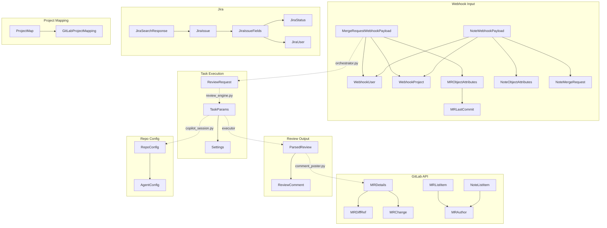

# Data Models

All Pydantic models in the codebase, grouped by module and purpose.

---

## Webhook Models (`models.py`)

All models use `strict=True` validation.

### `WebhookUser`
**Purpose**: User who triggered the webhook event.

| Field | Type | Description |
|-------|------|-------------|
| `id` | `int` | GitLab user ID |
| `username` | `str` | GitLab username |

---

### `WebhookProject`
**Purpose**: Project context from webhook payload.

| Field | Type | Description |
|-------|------|-------------|
| `id` | `int` | Numeric project ID for API calls |
| `path_with_namespace` | `str` | Full path (e.g., "group/project") |
| `git_http_url` | `str` | HTTPS clone URL |

---

### `MRLastCommit`
**Purpose**: Last commit metadata in MR.

| Field | Type | Description |
|-------|------|-------------|
| `id` | `str` | Commit SHA |
| `message` | `str` | Commit message |

---

### `MRObjectAttributes`
**Purpose**: Merge request attributes from webhook.

| Field | Type | Required | Description |
|-------|------|----------|-------------|
| `iid` | `int` | ✅ | MR number within the project |
| `title` | `str` | ✅ | MR title |
| `description` | `str \| None` | ❌ | MR description |
| `action` | `str` | ✅ | Trigger action: open, update, merge, close, etc. |
| `source_branch` | `str` | ✅ | Source branch name |
| `target_branch` | `str` | ✅ | Target branch name |
| `last_commit` | `MRLastCommit` | ✅ | Last commit metadata |
| `url` | `str` | ✅ | MR web URL |
| `oldrev` | `str \| None` | ❌ | Previous head SHA; present on 'update' only when commits changed |

---

### `MergeRequestWebhookPayload`
**Purpose**: Complete MR webhook payload (relevant fields only).

| Field | Type | Description |
|-------|------|-------------|
| `object_kind` | `str` | Event type, must be "merge_request" |
| `user` | `WebhookUser` | User who triggered event |
| `project` | `WebhookProject` | Project context |
| `object_attributes` | `MRObjectAttributes` | MR metadata |

---

### `NoteObjectAttributes`
**Purpose**: Note (comment) attributes from webhook.

| Field | Type | Description |
|-------|------|-------------|
| `note` | `str` | Comment body text |
| `noteable_type` | `str` | Type of noteable: MergeRequest, Issue, etc. |

---

### `NoteMergeRequest`
**Purpose**: MR context for note webhook.

| Field | Type | Description |
|-------|------|-------------|
| `iid` | `int` | MR number |
| `title` | `str` | MR title |
| `source_branch` | `str` | Source branch |
| `target_branch` | `str` | Target branch |

---

### `NoteWebhookPayload`
**Purpose**: Note webhook payload for MR comments.

| Field | Type | Description |
|-------|------|-------------|
| `object_kind` | `str` | Event type, should be "note" |
| `user` | `WebhookUser` | Comment author |
| `project` | `WebhookProject` | Project context |
| `object_attributes` | `NoteObjectAttributes` | Note metadata |
| `merge_request` | `NoteMergeRequest` | MR context |

---

## GitLab API Models (`gitlab_client.py`)

All models use `extra="ignore"` to allow additional API fields.

### `MRAuthor`
**Purpose**: MR author from GitLab API list response.

| Field | Type | Description |
|-------|------|-------------|
| `id` | `int` | User ID |
| `username` | `str` | Username |

---

### `MRListItem`
**Purpose**: Subset of fields from GitLab MR list API response.

| Field | Type | Description |
|-------|------|-------------|
| `iid` | `int` | MR number |
| `title` | `str` | MR title |
| `description` | `str \| None` | MR description |
| `source_branch` | `str` | Source branch |
| `target_branch` | `str` | Target branch |
| `sha` | `str` | Current HEAD SHA |
| `web_url` | `str` | MR web URL |
| `state` | `str` | MR state (opened, merged, closed) |
| `author` | `MRAuthor` | MR author |
| `updated_at` | `str` | ISO timestamp of last update |

---

### `NoteListItem`
**Purpose**: Subset of fields from GitLab MR notes API response.

| Field | Type | Description |
|-------|------|-------------|
| `id` | `int` | Note ID |
| `body` | `str` | Comment text |
| `author` | `MRAuthor` | Comment author |
| `system` | `bool` | Whether this is a system note (default: False) |
| `created_at` | `str` | ISO timestamp of creation |

---

### `MRDiffRef`
**Purpose**: Git diff reference SHAs for a merge request.

**Config**: `frozen=True` (immutable)

| Field | Type | Description |
|-------|------|-------------|
| `base_sha` | `str` | Base commit SHA (target branch) |
| `start_sha` | `str` | Start commit SHA |
| `head_sha` | `str` | Head commit SHA (source branch) |

---

### `MRChange`
**Purpose**: A single file change in a merge request.

**Config**: `frozen=True` (immutable)

| Field | Type | Default | Description |
|-------|------|---------|-------------|
| `old_path` | `str` | — | Original file path |
| `new_path` | `str` | — | New file path |
| `diff` | `str` | — | Unified diff content |
| `new_file` | `bool` | `False` | Whether this is a new file |
| `deleted_file` | `bool` | `False` | Whether this file was deleted |
| `renamed_file` | `bool` | `False` | Whether this file was renamed |

---

### `MRDetails`
**Purpose**: Merge request metadata and file changes.

**Config**: `frozen=True` (immutable)

| Field | Type | Default | Description |
|-------|------|---------|-------------|
| `title` | `str` | — | MR title |
| `description` | `str \| None` | — | MR description |
| `diff_refs` | `MRDiffRef` | — | Git diff reference SHAs |
| `changes` | `list[MRChange]` | `[]` | List of file changes |

---

## Jira Models (`jira_models.py`)

All models use `extra="ignore"` to allow additional API fields.

### `JiraUser`
**Purpose**: Jira user reference.

| Field | Type | Required | Description |
|-------|------|----------|-------------|
| `account_id` | `str` | ✅ | Jira Cloud account ID |
| `display_name` | `str` | ✅ | User display name |
| `email_address` | `str \| None` | ❌ | User email if available |

---

### `JiraStatus`
**Purpose**: Jira issue status.

| Field | Type | Description |
|-------|------|-------------|
| `name` | `str` | Status display name (e.g., "AI Ready") |
| `id` | `str` | Status ID |

---

### `JiraIssueFields`
**Purpose**: Fields within a Jira issue response.

| Field | Type | Required | Description |
|-------|------|----------|-------------|
| `summary` | `str` | ✅ | Issue title/summary |
| `description` | `str \| dict[str, Any] \| None` | ❌ | Issue description (ADF dict or plain text) |
| `status` | `JiraStatus` | ✅ | Current issue status |
| `assignee` | `JiraUser \| None` | ❌ | Assigned user |
| `labels` | `list[str]` | ❌ | Issue labels (default: []) |

---

### `JiraIssue`
**Purpose**: A Jira issue from the REST API.

| Field | Type | Description |
|-------|------|-------------|
| `id` | `str` | Jira issue ID |
| `key` | `str` | Issue key (e.g., "PROJ-123") |
| `fields` | `JiraIssueFields` | Issue fields |

**Property**:
- `project_key: str` — Extract project key from issue key (e.g., "PROJ" from "PROJ-123")

---

### `JiraSearchResponse`
**Purpose**: Response from Jira v3 search/jql endpoint.

| Field | Type | Alias | Default | Description |
|-------|------|-------|---------|-------------|
| `issues` | `list[JiraIssue]` | — | `[]` | Matching issues |
| `next_page_token` | `str \| None` | `nextPageToken` | `None` | Token for next page |
| `total` | `int` | — | `0` | Total matching issues |

---

### `JiraTransition`
**Purpose**: A Jira issue transition.

| Field | Type | Description |
|-------|------|-------------|
| `id` | `str` | Transition ID |
| `name` | `str` | Transition name |

---

### `JiraTransitionsResponse`
**Purpose**: Response from Jira transitions endpoint.

| Field | Type | Default | Description |
|-------|------|---------|-------------|
| `transitions` | `list[JiraTransition]` | `[]` | Available transitions |

---

## Config Models (`config.py`)

### `JiraSettings`
**Purpose**: Jira configuration — all optional (service runs review-only without these).

**Config**: `strict=True`

| Field | Type | Default | Description |
|-------|------|---------|-------------|
| `url` | `str` | — | Jira instance URL |
| `email` | `str` | — | Jira user email for basic auth |
| `api_token` | `str` | — | Jira API token or PAT |
| `trigger_status` | `str` | `"AI Ready"` | Status that triggers the agent |
| `in_progress_status` | `str` | `"In Progress"` | Status to transition to after pickup |
| `poll_interval` | `int` | `30` | Polling interval in seconds |
| `project_map_json` | `str` | — | JSON string mapping Jira projects to GitLab |

---

### `Settings`
**Purpose**: Service configuration loaded from environment variables.

See [configuration-reference.md](configuration-reference.md) for all fields.

**Property**:
- `jira: JiraSettings | None` — Return JiraSettings if all required Jira fields are set, else None

**Validators**:
- `_check_auth()`: Ensure either GITHUB_TOKEN or COPILOT_PROVIDER_TYPE is set
- `_check_auth()`: Validate REDIS_URL is set when STATE_BACKEND=redis
- `_check_auth()`: Validate GITLAB_PROJECTS is set when GITLAB_POLL=true

---

## Review Models (`comment_parser.py`)

### `ReviewComment`
**Purpose**: A single review comment on a specific file and line.

**Config**: `frozen=True` (immutable)

| Field | Type | Default | Description |
|-------|------|---------|-------------|
| `file` | `str` | — | Path to the reviewed file |
| `line` | `int` | — | Line number of the comment |
| `severity` | `str` | — | Severity level: error, warning, or info |
| `comment` | `str` | — | Review comment text |
| `suggestion` | `str \| None` | `None` | Suggested replacement code |
| `suggestion_start_offset` | `int` | `0` | Lines above the commented line to replace |
| `suggestion_end_offset` | `int` | `0` | Lines below the commented line to replace |

---

### `ParsedReview`
**Purpose**: Structured review output with comments and a summary.

| Field | Type | Description |
|-------|------|-------------|
| `comments` | `list[ReviewComment]` | List of review comments |
| `summary` | `str` | Summary paragraph of the review |

---

## Task Execution Models (`task_executor.py`, `review_engine.py`)

### `TaskParams`
**Purpose**: Parameters for a Copilot task execution.

**Config**: `frozen=True`, `arbitrary_types_allowed=True`

| Field | Type | Default | Description |
|-------|------|---------|-------------|
| `task_type` | `Literal["review", "coding"]` | — | Type of task to execute |
| `task_id` | `str` | — | Unique identifier for this task |
| `repo_url` | `str` | — | Git clone URL for the repository |
| `branch` | `str` | — | Branch to review or work on |
| `system_prompt` | `str` | — | System prompt for the Copilot session |
| `user_prompt` | `str` | — | User prompt for the Copilot session |
| `settings` | `Settings` | — | Application settings |
| `repo_path` | `str \| None` | `None` | Local path to cloned repo |

---

### `ReviewRequest`
**Purpose**: Minimal info the agent needs to perform a review.

**Config**: `frozen=True` (immutable)

| Field | Type | Description |
|-------|------|-------------|
| `title` | `str` | MR title |
| `description` | `str \| None` | MR description |
| `source_branch` | `str` | Source branch name |
| `target_branch` | `str` | Target branch name |

---

## Repo Config Models (`repo_config.py`)

### `AgentConfig`
**Purpose**: Configuration for a custom Copilot agent parsed from .agent.md files.

**Config**: `frozen=True` (immutable)

| Field | Type | Default | Description |
|-------|------|---------|-------------|
| `name` | `str` | — | Agent identifier |
| `prompt` | `str` | — | Agent system prompt from markdown body |
| `description` | `str \| None` | `None` | Human-readable agent description |
| `tools` | `list[str] \| None` | `None` | List of tool names the agent can use |
| `display_name` | `str \| None` | `None` | Display name for the agent |
| `mcp_servers` | `list[str] \| None` | `None` | MCP server names the agent connects to |
| `infer` | `bool \| None` | `None` | Whether the agent supports inference |

---

### `RepoConfig`
**Purpose**: Discovered repo-level Copilot configuration.

**Config**: `frozen=True` (immutable)

| Field | Type | Default | Description |
|-------|------|---------|-------------|
| `skill_directories` | `list[str]` | `[]` | Paths to skill directories |
| `custom_agents` | `list[AgentConfig]` | `[]` | Custom agent configurations |
| `instructions` | `str \| None` | `None` | Combined instruction text from all sources |

---

## Project Mapping Models (`project_mapping.py`)

### `GitLabProjectMapping`
**Purpose**: Mapping entry for a single Jira project to its GitLab counterpart.

**Config**: `strict=True`

| Field | Type | Default | Description |
|-------|------|---------|-------------|
| `gitlab_project_id` | `int` | — | GitLab project ID |
| `clone_url` | `str` | — | GitLab repo HTTPS clone URL |
| `target_branch` | `str` | `"main"` | Default MR target branch |

---

### `ProjectMap`
**Purpose**: Collection of Jira→GitLab project mappings loaded from config.

**Config**: `strict=True`

| Field | Type | Default | Description |
|-------|------|---------|-------------|
| `mappings` | `dict[str, GitLabProjectMapping]` | `{}` | Map of Jira project key → GitLab project config |

**Methods**:
- `get(jira_project_key: str) -> GitLabProjectMapping | None`: Look up GitLab project for a Jira project key
- `__contains__(key: str) -> bool`: Check if key is in mappings

---

## Model Relationships

---

## Validation Rules Summary

| Model Family | Strict Mode | Extra Fields | Frozen |
|--------------|-------------|--------------|--------|
| Webhook (`models.py`) | ✅ Yes | ❌ Forbidden | ❌ No |
| GitLab API (`gitlab_client.py`) | ❌ No | ✅ Ignored | ✅ Yes (most) |
| Jira (`jira_models.py`) | ❌ No | ✅ Ignored | ❌ No |
| Config (`config.py`) | ✅ Yes | ❌ Forbidden | ❌ No |
| Review (`comment_parser.py`) | ❌ No | ❌ Forbidden | ✅ Yes |
| Task Exec (`task_executor.py`) | ❌ No | ❌ Forbidden | ✅ Yes |
| Repo Config (`repo_config.py`) | ❌ No | ❌ Forbidden | ✅ Yes |
| Project Mapping (`project_mapping.py`) | ✅ Yes | ❌ Forbidden | ❌ No |

**Strict Mode**: Rejects unknown fields and enforces exact type matching.  
**Frozen**: Immutable after creation (hash-safe, thread-safe for reads).
