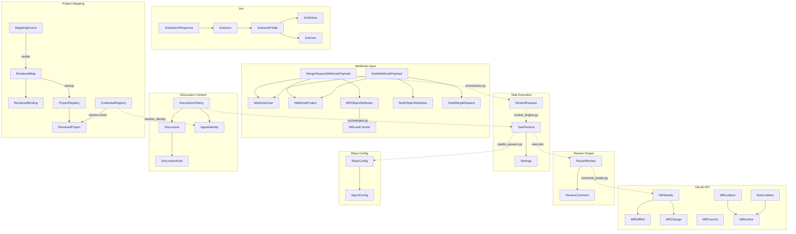

# Data Models

All Pydantic models in the codebase, grouped by module and purpose.

---

## Config v2 Models (`config_v2.py`)

GitLab-centric YAML configuration. All models use `strict=True` validation.

### `ConfigFile`
**Purpose**: Root config model (version 2). Primary non-secret config source.

| Field | Type | Default | Description |
|-------|------|---------|-------------|
| `version` | `Literal[2]` | — | Schema version, must be 2 |
| `gitlab` | `GitLabConfig` | — | GitLab instance URL |
| `dispatch` | `DispatchConfig` | `local` backend | Task dispatch backend |
| `copilot` | `CopilotConfig` | `gpt-4` | Global Copilot defaults |
| `server` | `ServerConfig` | defaults | Server operational config |
| `prompts` | `PromptsConfig` | all `None` | Prompt overrides |
| `defaults` | `ConfigDefaults` | defaults | Default values for projects |
| `projects` | `list[ProjectConfig]` | `[]` | GitLab project definitions |
| `integrations` | `list[IntegrationConfig]` | `[]` | Named integrations |

**Validators**: `_validate_integration_refs` (all project integration refs must exist), `_validate_unique_repos` (no duplicate repos)

**Methods**: `resolve_project(project)` — apply defaults to a project; `get_integration(name)` — lookup by name

---

### `ProjectConfig`
**Purpose**: A single GitLab project. All fields except `repo` are optional and fall back to `ConfigDefaults`.

| Field | Type | Default | Description |
|-------|------|---------|-------------|
| `repo` | `str` | — | GitLab `path_with_namespace` |
| `credential_ref` | `str \| None` | `None` | Credential alias |
| `target_branch` | `str \| None` | `None` | MR target branch |
| `resolution_behavior` | `ResolutionBehavior \| None` | `None` | `auto-resolve`, `suggest`, or `off` |
| `webhook` | `bool \| None` | `None` | Webhook trigger enabled |
| `poll` | `PollConfig \| None` | `None` | Polling configuration |
| `copilot` | `CopilotConfig \| None` | `None` | Per-project Copilot overrides |
| `integrations` | `list[str]` | `[]` | Integration names |

---

### `JiraIntegrationConfig`
**Purpose**: Jira integration referenced by projects.

| Field | Type | Default | Description |
|-------|------|---------|-------------|
| `name` | `str` | — | Unique name referenced by projects |
| `type` | `Literal["jira"]` | — | Integration discriminator |
| `project_key` | `str` | — | Jira project key |
| `trigger_status` | `str` | `"AI Ready"` | Status that triggers agent |
| `in_progress_status` | `str` | `"In Progress"` | Status after pickup |
| `in_review_status` | `str` | `"In Review"` | Status after MR creation |

---

### `AppContext` (`app_context.py`)
**Purpose**: Frozen dataclass holding all immutable service references. Created in lifespan, accessed via `get_app_context(request)`.

| Field | Type | Description |
|-------|------|-------------|
| `settings` | `Settings` | Environment-based config |
| `executor` | `TaskExecutor` | Task execution backend |
| `repo_locks` | `DistributedLock` | Concurrency locks |
| `dedup_store` | `DeduplicationStore` | Deduplication tracking |
| `dedup` | `DeduplicationService` | Unified dedup (reviews, notes, issues) |
| `credential_registry` | `CredentialRegistry` | Token + identity resolution (TTL-cached) |
| `allowed_project_ids` | `frozenset[int] \| None` | Project allowlist |

**Note**: Mutable state (`project_registry`, pollers) stays on `app.state` directly for hot-reload support.

---

### `TaskEvent` (`events.py`)
**Purpose**: Unified internal event model replacing direct webhook payload passing. All ingestion sources (webhooks, pollers) produce `TaskEvent` instances that flow to orchestrators and pipelines.

**Config**: Pydantic model

| Field | Type | Description |
|-------|------|-------------|
| Normalized fields from webhook payloads | Various | Project ID, MR IID, event type, user, branches, etc. |

**Used By**: `webhook.py`, `gitlab_poller.py` → produce; `orchestrator.py`, `discussion_orchestrator.py`, `review_pipeline.py`, `discussion_pipeline.py`, `coding_pipeline.py` → consume

---

## Webhook Models (`models.py`)

All models use `strict=True` validation.

### `WebhookUser`
**Purpose**: User who triggered the webhook event.

| Field | Type | Description |
|-------|------|-------------|
| `id` | `int` | GitLab user ID |
| `username` | `str` | GitLab username |

---

### `WebhookProject`
**Purpose**: Project context from webhook payload.

| Field | Type | Description |
|-------|------|-------------|
| `id` | `int` | Numeric project ID for API calls |
| `path_with_namespace` | `str` | Full path (e.g., "group/project") |
| `git_http_url` | `str` | HTTPS clone URL |

---

### `MRLastCommit`
**Purpose**: Last commit metadata in MR.

| Field | Type | Description |
|-------|------|-------------|
| `id` | `str` | Commit SHA |
| `message` | `str` | Commit message |

---

### `MRObjectAttributes`
**Purpose**: Merge request attributes from webhook.

| Field | Type | Required | Description |
|-------|------|----------|-------------|
| `iid` | `int` | ✅ | MR number within the project |
| `title` | `str` | ✅ | MR title |
| `description` | `str \| None` | ❌ | MR description |
| `action` | `str` | ✅ | Trigger action: open, update, merge, close, etc. |
| `source_branch` | `str` | ✅ | Source branch name |
| `target_branch` | `str` | ✅ | Target branch name |
| `last_commit` | `MRLastCommit` | ✅ | Last commit metadata |
| `url` | `str` | ✅ | MR web URL |
| `oldrev` | `str \| None` | ❌ | Previous head SHA; present on 'update' only when commits changed |

---

### `MergeRequestWebhookPayload`
**Purpose**: Complete MR webhook payload (relevant fields only).

| Field | Type | Description |
|-------|------|-------------|
| `object_kind` | `str` | Event type, must be "merge_request" |
| `user` | `WebhookUser` | User who triggered event |
| `project` | `WebhookProject` | Project context |
| `object_attributes` | `MRObjectAttributes` | MR metadata |

---

### `NoteObjectAttributes`
**Purpose**: Note (comment) attributes from webhook.

| Field | Type | Description |
|-------|------|-------------|
| `note` | `str` | Comment body text |
| `noteable_type` | `str` | Type of noteable: MergeRequest, Issue, etc. |

---

### `NoteMergeRequest`
**Purpose**: MR context for note webhook.

| Field | Type | Description |
|-------|------|-------------|
| `iid` | `int` | MR number |
| `title` | `str` | MR title |
| `source_branch` | `str` | Source branch |
| `target_branch` | `str` | Target branch |

---

### `NoteWebhookPayload`
**Purpose**: Note webhook payload for MR comments.

| Field | Type | Description |
|-------|------|-------------|
| `object_kind` | `str` | Event type, should be "note" |
| `user` | `WebhookUser` | Comment author |
| `project` | `WebhookProject` | Project context |
| `object_attributes` | `NoteObjectAttributes` | Note metadata |
| `merge_request` | `NoteMergeRequest` | MR context |

---

## GitLab API Models (`gitlab_client.py`)

All models use `extra="ignore"` to allow additional API fields.

### `MRAuthor`
**Purpose**: MR author from GitLab API list response.

| Field | Type | Description |
|-------|------|-------------|
| `id` | `int` | User ID |
| `username` | `str` | Username |

---

### `MRListItem`
**Purpose**: Subset of fields from GitLab MR list API response.

| Field | Type | Description |
|-------|------|-------------|
| `iid` | `int` | MR number |
| `title` | `str` | MR title |
| `description` | `str \| None` | MR description |
| `source_branch` | `str` | Source branch |
| `target_branch` | `str` | Target branch |
| `sha` | `str` | Current HEAD SHA |
| `web_url` | `str` | MR web URL |
| `state` | `str` | MR state (opened, merged, closed) |
| `author` | `MRAuthor` | MR author |
| `updated_at` | `str` | ISO timestamp of last update |

---

### `NoteListItem`
**Purpose**: Subset of fields from GitLab MR notes API response.

| Field | Type | Description |
|-------|------|-------------|
| `id` | `int` | Note ID |
| `body` | `str` | Comment text |
| `author` | `MRAuthor` | Comment author |
| `system` | `bool` | Whether this is a system note (default: False) |
| `created_at` | `str` | ISO timestamp of creation |

---

### `MRDiffRef`
**Purpose**: Git diff reference SHAs for a merge request.

**Config**: `frozen=True` (immutable)

| Field | Type | Description |
|-------|------|-------------|
| `base_sha` | `str` | Base commit SHA (target branch) |
| `start_sha` | `str` | Start commit SHA |
| `head_sha` | `str` | Head commit SHA (source branch) |

---

### `MRChange`
**Purpose**: A single file change in a merge request.

**Config**: `frozen=True` (immutable)

| Field | Type | Default | Description |
|-------|------|---------|-------------|
| `old_path` | `str` | — | Original file path |
| `new_path` | `str` | — | New file path |
| `diff` | `str` | — | Unified diff content |
| `new_file` | `bool` | `False` | Whether this is a new file |
| `deleted_file` | `bool` | `False` | Whether this file was deleted |
| `renamed_file` | `bool` | `False` | Whether this file was renamed |

---

### `MRDetails`
**Purpose**: Merge request metadata and file changes.

**Config**: `frozen=True` (immutable)

| Field | Type | Default | Description |
|-------|------|---------|-------------|
| `title` | `str` | — | MR title |
| `description` | `str \| None` | — | MR description |
| `diff_refs` | `MRDiffRef` | — | Git diff reference SHAs |
| `changes` | `list[MRChange]` | `[]` | List of file changes |

---

### `MRCommit`
**Purpose**: A single commit on a merge request, used for developer intent context.

**Config**: `frozen=True`, `extra="ignore"` (immutable, extra fields ignored)

| Field | Type | Description |
|-------|------|-------------|
| `id` | `str` | Full commit SHA |
| `title` | `str` | First line of the commit message |
| `message` | `str` | Full commit message body |

---

## Discussion Models (`discussion_models.py`)

Models for MR discussion history, shared by review and discussion flows. All models use `frozen=True` (immutable).

### `DiscussionNote`
**Purpose**: A single note within a discussion thread.

**Config**: `frozen=True` (immutable)

| Field | Type | Default | Description |
|-------|------|---------|-------------|
| `note_id` | `int` | — | GitLab note ID |
| `author_id` | `int` | — | Author's GitLab user ID |
| `author_username` | `str` | — | Author's GitLab username (for display) |
| `body` | `str` | — | Note body text |
| `created_at` | `str` | — | ISO 8601 timestamp |
| `is_system` | `bool` | — | True for system-generated notes |
| `resolved` | `bool \| None` | `None` | Resolution status (None if not resolvable) |
| `resolved_by_id` | `int \| None` | `None` | User ID of who resolved this note, None if unresolved |
| `resolvable` | `bool` | `False` | Whether the note can be resolved |
| `position` | `dict[str, object] \| None` | `None` | Diff position: new_path, old_path, new_line, old_line, head_sha |

---

### `Discussion`
**Purpose**: A threaded discussion on a merge request.

**Config**: `frozen=True` (immutable)

| Field | Type | Default | Description |
|-------|------|---------|-------------|
| `discussion_id` | `str` | — | GitLab discussion ID |
| `notes` | `list[DiscussionNote]` | — | Notes in thread order |
| `is_resolved` | `bool` | `False` | Whether the discussion is resolved |
| `is_inline` | `bool` | `False` | True for DiffNote (inline), False for overview |

---

### `AgentIdentity`
**Purpose**: The agent's GitLab identity, discovered via `GET /user`.

**Config**: `frozen=True` (immutable)

| Field | Type | Description |
|-------|------|-------------|
| `user_id` | `int` | Immutable GitLab user ID |
| `username` | `str` | GitLab username (mutable, for display/@mention) |

---

### `DiscussionHistory`
**Purpose**: Full discussion context for an MR, including agent identity.

| Field | Type | Default | Description |
|-------|------|---------|-------------|
| `discussions` | `list[Discussion]` | `[]` | All discussions on the MR |
| `agent` | `AgentIdentity` | — | Agent identity for self-detection |

---

## Jira Models (`jira_models.py`)

All models use `extra="ignore"` to allow additional API fields.

### `JiraUser`
**Purpose**: Jira user reference.

| Field | Type | Required | Description |
|-------|------|----------|-------------|
| `account_id` | `str` | ✅ | Jira Cloud account ID |
| `display_name` | `str` | ✅ | User display name |
| `email_address` | `str \| None` | ❌ | User email if available |

---

### `JiraStatus`
**Purpose**: Jira issue status.

| Field | Type | Description |
|-------|------|-------------|
| `name` | `str` | Status display name (e.g., "AI Ready") |
| `id` | `str` | Status ID |

---

### `JiraIssueFields`
**Purpose**: Fields within a Jira issue response.

| Field | Type | Required | Description |
|-------|------|----------|-------------|
| `summary` | `str` | ✅ | Issue title/summary |
| `description` | `str \| dict[str, Any] \| None` | ❌ | Issue description (ADF dict or plain text) |
| `status` | `JiraStatus` | ✅ | Current issue status |
| `assignee` | `JiraUser \| None` | ❌ | Assigned user |
| `labels` | `list[str]` | ❌ | Issue labels (default: []) |

---

### `JiraIssue`
**Purpose**: A Jira issue from the REST API.

| Field | Type | Description |
|-------|------|-------------|
| `id` | `str` | Jira issue ID |
| `key` | `str` | Issue key (e.g., "PROJ-123") |
| `fields` | `JiraIssueFields` | Issue fields |

**Property**:
- `project_key: str` — Extract project key from issue key (e.g., "PROJ" from "PROJ-123")

---

### `JiraSearchResponse`
**Purpose**: Response from Jira v3 search/jql endpoint.

| Field | Type | Alias | Default | Description |
|-------|------|-------|---------|-------------|
| `issues` | `list[JiraIssue]` | — | `[]` | Matching issues |
| `next_page_token` | `str \| None` | `nextPageToken` | `None` | Token for next page |
| `total` | `int` | — | `0` | Total matching issues |

---

### `JiraTransition`
**Purpose**: A Jira issue transition.

| Field | Type | Description |
|-------|------|-------------|
| `id` | `str` | Transition ID |
| `name` | `str` | Transition name |

---

### `JiraTransitionsResponse`
**Purpose**: Response from Jira transitions endpoint.

| Field | Type | Default | Description |
|-------|------|---------|-------------|
| `transitions` | `list[JiraTransition]` | `[]` | Available transitions |

---

## Config Models (`config/`)

### `JiraSettings`
**Purpose**: Jira configuration — all optional (service runs review-only without these).

**Config**: `strict=True`

| Field | Type | Default | Description |
|-------|------|---------|-------------|
| `url` | `str` | — | Jira instance URL |
| `email` | `str` | — | Jira user email for basic auth |
| `api_token` | `str` | — | Jira API token or PAT |
| `trigger_status` | `str` | `"AI Ready"` | Status that triggers the agent |
| `in_progress_status` | `str` | `"In Progress"` | Status to transition to after pickup |
| `poll_interval` | `int` | `30` | Polling interval in seconds |
| `project_map_json` | `str` | — | JSON string mapping Jira projects to GitLab |

---

### `Settings`
**Purpose**: Service configuration loaded from environment variables.

See [configuration-reference.md](configuration-reference.md) for all fields.

**Property**:
- `jira: JiraSettings | None` — Return JiraSettings if all required Jira fields are set, else None

**Validators**:
- `_check_auth()`: Ensure either GITHUB_TOKEN or COPILOT_PROVIDER_TYPE is set
- `_check_redis_for_remote_executors()`: Validate REDIS_URL or REDIS_HOST is set for kubernetes/container_apps executors
- `_check_state_backend()`: Validate REDIS_URL or REDIS_HOST is set when STATE_BACKEND=redis
- `_check_auth()`: Validate GITLAB_PROJECTS is set when GITLAB_POLL=true

**Property**:
- `redis_configured: bool` — True when either `redis_url` or `redis_host` is set (single source of truth for Redis availability)

---

## Review Models (`comment_parser.py`)

### `ReviewComment`
**Purpose**: A single review comment on a specific file and line.

**Config**: `frozen=True` (immutable)

| Field | Type | Default | Description |
|-------|------|---------|-------------|
| `file` | `str` | — | Path to the reviewed file |
| `line` | `int` | — | Line number of the comment |
| `severity` | `str` | — | Severity level: error, warning, or info |
| `comment` | `str` | — | Review comment text |
| `suggestion` | `str \| None` | `None` | Suggested replacement code |
| `suggestion_start_offset` | `int` | `0` | Lines above the commented line to replace |
| `suggestion_end_offset` | `int` | `0` | Lines below the commented line to replace |

---

### `Resolution`
**Purpose**: A resolution determination for a prior feedback thread.

**Config**: `frozen=True` (immutable)

| Field | Type | Default | Description |
|-------|------|---------|-------------|
| `discussion_id` | `str` | — | GitLab discussion ID of the prior feedback |
| `status` | `str` | — | Resolution status: `resolved`, `not_addressed`, or `partial` |
| `message` | `str` | — | Acknowledgment or explanation message |

---

### `ParsedReview`
**Purpose**: Structured review output with comments, resolutions, and a summary.

| Field | Type | Default | Description |
|-------|------|---------|-------------|
| `comments` | `list[ReviewComment]` | — | List of review comments |
| `summary` | `str` | — | Summary paragraph of the review |
| `resolutions` | `list[Resolution]` | `[]` | Resolution determinations for prior feedback threads |

---

## Coding Pipeline Models (`coding_engine.py`)

### `CodingAgentOutput`
**Purpose**: Structured output expected from the coding agent's final message.

**Config**: `strict=True`

| Field | Type | Description |
|-------|------|-------------|
| `summary` | `str` | Brief description of changes made and test results |
| `files_changed` | `list[str]` | Paths of files intentionally created, modified, or deleted (excludes generated artifacts like `__pycache__/`, `*.pyc`) |

**Parsing**: Extracted from agent response via regex matching fenced JSON blocks (`` ```json ... ``` ``). If the agent doesn't include a valid JSON block, the session retries once with explicit format instructions.

---

## Task Execution Models (`task_executor.py`, `review_engine.py`)

### `TaskParams`
**Purpose**: Parameters for a Copilot task execution.

**Config**: `frozen=True`, `arbitrary_types_allowed=True`

| Field | Type | Default | Description |
|-------|------|---------|-------------|
| `task_type` | `Literal["review", "coding"]` | — | Type of task to execute |
| `task_id` | `str` | — | Unique identifier for this task |
| `repo_url` | `str` | — | Git clone URL for the repository |
| `branch` | `str` | — | Branch to review or work on |
| `system_prompt` | `str` | — | System prompt for the Copilot session |
| `user_prompt` | `str` | — | User prompt for the Copilot session |
| `settings` | `Settings` | — | Application settings |
| `repo_path` | `str \| None` | `None` | Local path to cloned repo |

---

### `ReviewRequest`
**Purpose**: Minimal info the agent needs to perform a review.

**Config**: `frozen=True` (immutable)

| Field | Type | Description |
|-------|------|-------------|
| `title` | `str` | MR title |
| `description` | `str \| None` | MR description |
| `source_branch` | `str` | Source branch name |
| `target_branch` | `str` | Target branch name |
| `commit_messages` | `list[str]` | Commit messages for developer intent context (default: `[]`) |

---

## Repo Config Models (`repo_config.py`)

### `AgentConfig`
**Purpose**: Configuration for a custom Copilot agent parsed from .agent.md files.

**Config**: `frozen=True` (immutable)

| Field | Type | Default | Description |
|-------|------|---------|-------------|
| `name` | `str` | — | Agent identifier |
| `prompt` | `str` | — | Agent system prompt from markdown body |
| `description` | `str \| None` | `None` | Human-readable agent description |
| `tools` | `list[str] \| None` | `None` | List of tool names the agent can use |
| `display_name` | `str \| None` | `None` | Display name for the agent |
| `mcp_servers` | `list[str] \| None` | `None` | MCP server names the agent connects to |
| `infer` | `bool \| None` | `None` | Whether the agent supports inference |

---

### `RepoConfig`
**Purpose**: Discovered repo-level Copilot configuration.

**Config**: `frozen=True` (immutable)

| Field | Type | Default | Description |
|-------|------|---------|-------------|
| `skill_directories` | `list[str]` | `[]` | Paths to skill directories |
| `custom_agents` | `list[AgentConfig]` | `[]` | Custom agent configurations |
| `instructions` | `str \| None` | `None` | Combined instruction text from all sources |

---

## Project Mapping Models

### `RenderedBinding` (`mapping_models.py`)
**Purpose**: A single Jira→GitLab binding in the rendered JSON format.

**Config**: `strict=True`

| Field | Type | Default | Description |
|-------|------|---------|-------------|
| `repo` | `str` | — | GitLab repo path (e.g., `group/project`) |
| `target_branch` | `str` | — | Default MR target branch |
| `credential_ref` | `str` | — | Credential alias (`"default"` or named) |
| `trigger_status` | `str` | `"AI Ready"` | Jira status that triggers the agent |
| `in_progress_status` | `str` | `"In Progress"` | Jira status set when agent starts work |
| `in_review_status` | `str` | `"In Review"` | Jira status set after MR creation |

---

### `RenderedMap` (`mapping_models.py`)
**Purpose**: Top-level rendered JSON passed as `JIRA_PROJECT_MAP`.

**Config**: `strict=True`

| Field | Type | Default | Description |
|-------|------|---------|-------------|
| `mappings` | `dict[str, RenderedBinding]` | — | Map of Jira project key → binding |

---

### `ResolvedProject` (`project_registry.py`)
**Purpose**: Fully resolved project context for runtime use.

| Field | Type | Description |
|-------|------|-------------|
| `jira_project` | `str` | Jira project key |
| `repo` | `str` | GitLab repo path |
| `gitlab_project_id` | `int` | Resolved GitLab project ID |
| `clone_url` | `str` | HTTPS clone URL |
| `target_branch` | `str` | Default MR target branch |
| `credential_ref` | `str` | Credential alias |
| `token` | `str` | Resolved GitLab token (masked in repr) |
| `trigger_status` | `str` | Jira status that triggers the agent (`"AI Ready"`) |
| `in_progress_status` | `str` | Jira status set when agent starts work (`"In Progress"`) |
| `in_review_status` | `str` | Jira status set after MR creation (`"In Review"`) |

---

## Model Relationships


```mermaid
graph TB
    subgraph "Webhook Input"
        WHP[MergeRequestWebhookPayload]
        NWP[NoteWebhookPayload]
        WHP --> WU[WebhookUser]
        WHP --> WP[WebhookProject]
        WHP --> MRA[MRObjectAttributes]
        MRA --> MLC[MRLastCommit]
        NWP --> WU
        NWP --> WP
        NWP --> NOA[NoteObjectAttributes]
        NWP --> NMR[NoteMergeRequest]
    end
    
    subgraph "GitLab API"
        MRD[MRDetails]
        MRD --> MDR[MRDiffRef]
        MRD --> MRC[MRChange]
        MRCO[MRCommit]
        MRL[MRListItem]
        MRL --> MRA2[MRAuthor]
        NLI[NoteListItem]
        NLI --> MRA2
    end
    
    subgraph "Task Execution"
        TP[TaskParams]
        TP --> SET[Settings]
        RR[ReviewRequest]
    end
    
    subgraph "Review Output"
        PR[ParsedReview]
        PR --> RC[ReviewComment]
    end
    
    subgraph "Jira"
        JI[JiraIssue]
        JI --> JIF[JiraIssueFields]
        JIF --> JS[JiraStatus]
        JIF --> JU[JiraUser]
        JSR[JiraSearchResponse]
        JSR --> JI
    end
    
    subgraph "Repo Config"
        RCFG[RepoConfig]
        RCFG --> AC[AgentConfig]
    end
    
    subgraph "Discussion Context"
        DH[DiscussionHistory]
        DH --> DISC[Discussion]
        DISC --> DN[DiscussionNote]
        DH --> AI[AgentIdentity]
    end
    
    subgraph "Project Mapping"
        MS[MappingSource] -->|render| RM[RenderedMap]
        RM --> RB[RenderedBinding]
        RM -->|startup| PR2[ProjectRegistry]
        PR2 --> RP[ResolvedProject]
        CR[CredentialRegistry] -->|resolve token| RP
    end
    
    WHP -.->|orchestrator.py| RR
    RR -.->|review_engine.py| TP
    TP -.->|copilot_session.py| RCFG
    TP -.->|executor| PR
    PR -.->|comment_poster.py| MRD
    CR -.->|resolve_identity| AI
    DH -.->|orchestrator.py| TP
```

---

## Discussion Engine Models (`discussion_engine.py`)

### `DiscussionResponse`
**Purpose**: Parsed response from the discussion LLM session. Captures the reply text and whether code changes were made.

**Config**: `frozen=True` (immutable)

| Field | Type | Default | Description |
|-------|------|---------|-------------|
| `reply` | `str` | — | Reply text to post in the discussion thread |
| `has_code_changes` | `bool` | `False` | True if the LLM output contained a `files_changed` JSON block |
| `resolution` | `Resolution \| None` | `None` | Resolution determination for the triggering thread (from `comment_parser.Resolution`) |

**Parsing**: If the LLM output ends with a fenced JSON block containing `files_changed` (same format as the coding prompt), the reply is the text before the block and `has_code_changes` is True. If the block contains a `resolution` key, it is parsed as a `Resolution` object. Otherwise the entire output is the reply. No structured intent classification — the handler uses `has_code_changes` to decide whether to commit/push.

---

## Validation Rules Summary

| Model Family | Strict Mode | Extra Fields | Frozen |
|--------------|-------------|--------------|--------|
| Webhook (`models.py`) | ✅ Yes | ❌ Forbidden | ❌ No |
| GitLab API (`gitlab_client.py`) | ❌ No | ✅ Ignored | ✅ Yes (most) |
| Jira (`jira_models.py`) | ❌ No | ✅ Ignored | ❌ No |
| Config (`config/`) | ✅ Yes | ❌ Forbidden | ❌ No |
| Review (`comment_parser.py`) | ❌ No | ❌ Forbidden | ✅ Yes |
| Task Exec (`task_executor.py`) | ❌ No | ❌ Forbidden | ✅ Yes |
| Repo Config (`repo_config.py`) | ❌ No | ❌ Forbidden | ✅ Yes |
| Discussion (`discussion_models.py`) | ❌ No | ❌ Forbidden | ✅ Yes |
| Discussion Engine (`discussion_engine.py`) | ❌ No | ❌ Forbidden | ✅ Yes |


**Strict Mode**: Rejects unknown fields and enforces exact type matching.  
**Frozen**: Immutable after creation (hash-safe, thread-safe for reads).
