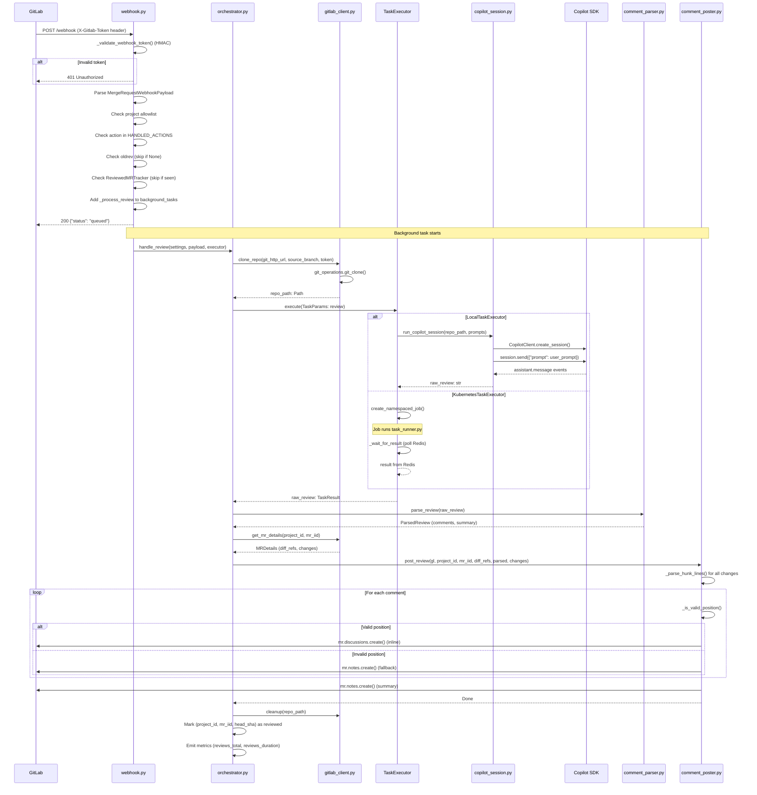
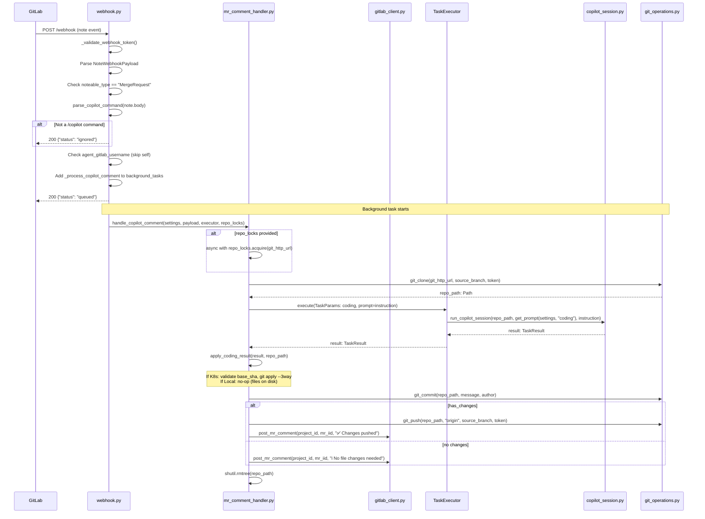
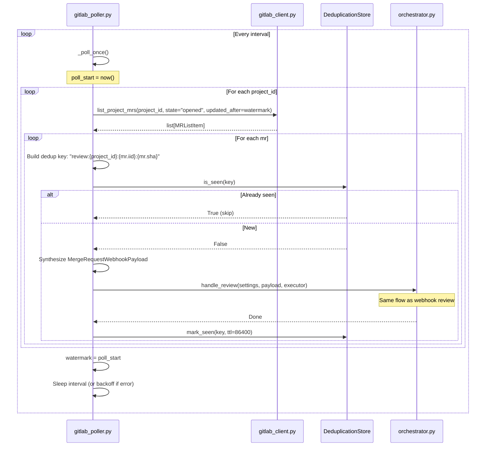
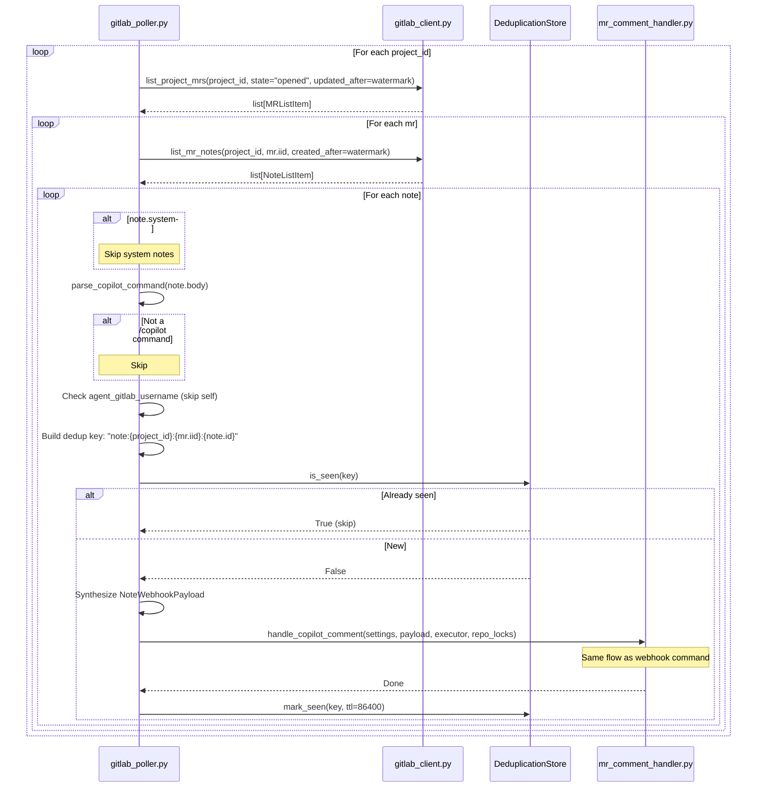
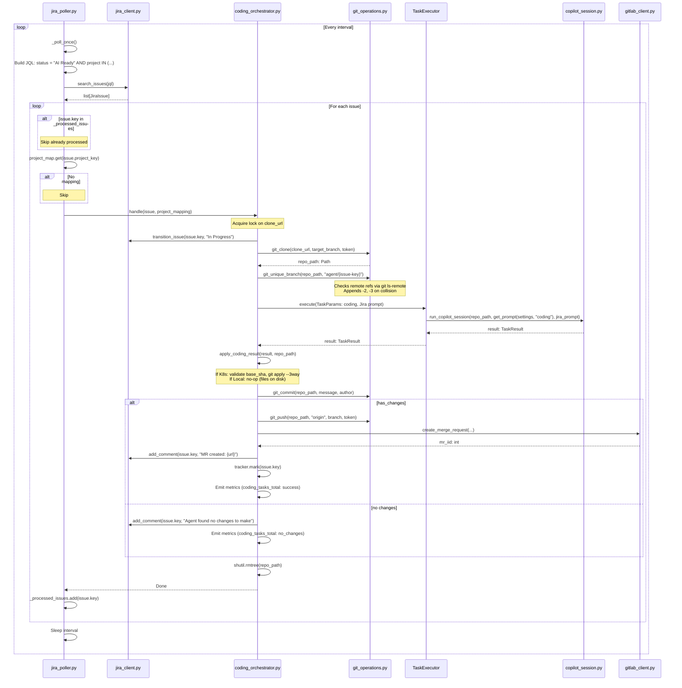

# Request Flows

End-to-end data flows with sequence diagrams for each major operation.

---

## 1. Webhook MR Review

Triggered when GitLab sends `merge_request` webhook with action `open` or `update` (with new commits).

**Error Handling**:
- On exception in background task: log, emit `webhook_errors_total`, post failure comment to MR, re-raise
- Cleanup: `repo_path` removed in finally block

---

## 2. Webhook /copilot Command

Triggered when GitLab sends `note` webhook for MR comment starting with `/copilot `.

**Error Handling**:
- On exception: log, emit `webhook_errors_total`, post "❌ Agent encountered an error" comment, re-raise
- Cleanup: `repo_path` removed in finally block

---

## 3. GitLab Poller MR Discovery

Background poller discovers new/updated MRs via GitLab API.

**Watermark Strategy**:
- `_watermark` initialized to `now()` on first start (avoids replaying historical notes)
- Updated to poll cycle start time after all projects processed
- `updated_after` filter ensures only MRs updated since last cycle are returned

**Dedup Key**: `review:{project_id}:{mr_iid}:{mr_sha}` (TTL: 24 hours)

**Error Handling**:
- On exception in `_poll_once()`: log, increment `_failures`, exponential backoff (max 300s)
- Successful cycle: reset `_failures` to 0

---

## 4. GitLab Poller Note Discovery

Background poller discovers `/copilot` notes on open MRs.

**Dedup Key**: `note:{project_id}:{mr_iid}:{note.id}` (TTL: 24 hours)

**Self-Comment Guard**: If `agent_gitlab_username` is set and matches note author, skip processing (prevents infinite loop if agent posts `/copilot` command).

---

## 5. Jira Poller Coding Task

Background poller discovers Jira issues in "AI Ready" status.

**Processed Tracker**: In-memory set of processed issue keys (cleared on service restart).

**Locking**: Per-repo lock on `clone_url` to prevent concurrent clone/push operations.

**Error Handling**:
- On exception: log, emit `coding_tasks_total` with outcome=error, post failure comment to Jira, re-raise
- Cleanup: `repo_path` removed in finally block

---

## Error Handling Patterns

### Webhook Background Tasks
- Exception logged with `aexception()` (includes stack trace)
- Metrics emitted: `webhook_errors_total` with label `handler="review"` or `handler="copilot_comment"`
- Failure comment posted to MR (best effort, secondary exception logged but swallowed)
- Exception re-raised (captured by FastAPI, returns 500 to webhook sender only if still in request context)

### Poller Tasks
- Exception logged with `aexception()`
- Failure counter incremented: `_failures += 1`
- Exponential backoff: `sleep(min(interval * 2**failures, 300))`
- Successful cycle resets `_failures = 0`

### Git Operations
- Token sanitized in error messages (replaced with `***`)
- Timeout enforced (120s for clone, 60s for other ops)
- Cleanup on error: `shutil.rmtree(tmp_dir, ignore_errors=True)` in clone

### Task Execution
- LocalTaskExecutor: exceptions propagate to caller
- KubernetesTaskExecutor:
  - Job timeout: delete Job, raise TimeoutError
  - Job failure: read pod logs, delete Job, raise RuntimeError with logs
  - Redis unavailable: exception propagates

### Copilot Session
- Timeout enforced via `asyncio.wait_for(done.wait(), timeout=timeout)`
- Session destroyed in finally block
- CLI path validation (raises if binary not found)

---

## Sequence Diagram Legend

- **Solid arrow (`->>`)**: Synchronous call or message
- **Dashed arrow (`-->>`)**: Return value or response
- **Alt block**: Conditional branching
- **Loop block**: Iteration
- **Note**: Clarifying comment

---

## Performance Characteristics

| Flow | Latency | Bottleneck | Parallelism |
|------|---------|-----------|-------------|
| Webhook MR review | 30-120s | Copilot SDK session | None (sequential: clone → review → post) |
| Webhook /copilot | 30-120s | Copilot SDK session | Per-repo lock (serializes concurrent commands on same MR) |
| GitLab poller (MR) | Poll interval + review latency | GitLab API rate limits | Sequential per project |
| GitLab poller (notes) | Poll interval + command latency | GitLab API rate limits | Sequential per project |
| Jira poller | Poll interval + coding latency | Jira API rate limits | Sequential per issue, per-repo lock |

**Copilot Session Timeout**: Default 300s (5 minutes), configurable per-call.

**GitLab API Rate Limits**: python-gitlab client retries on 429, respects Retry-After header.
