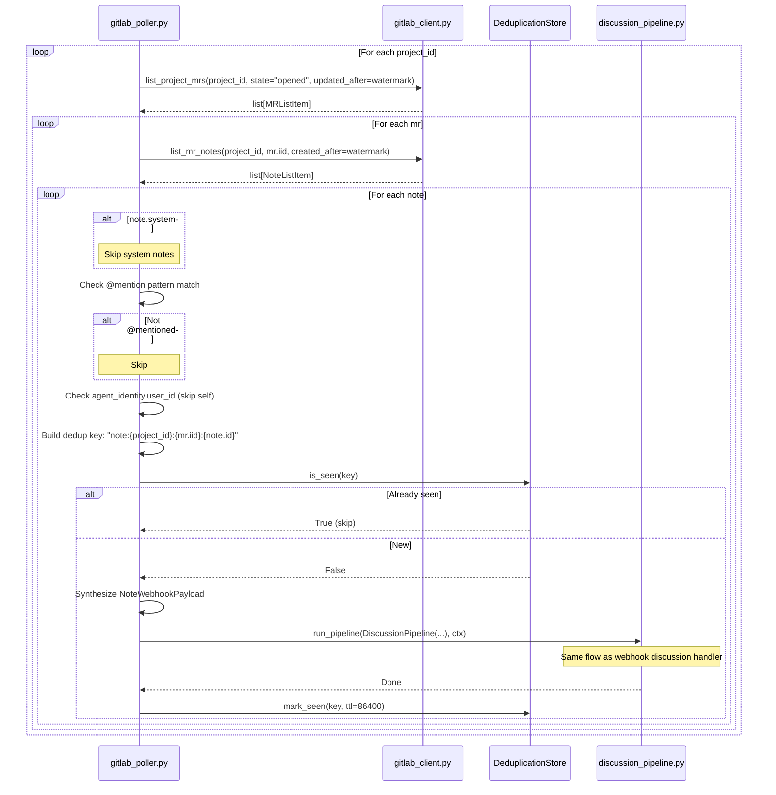
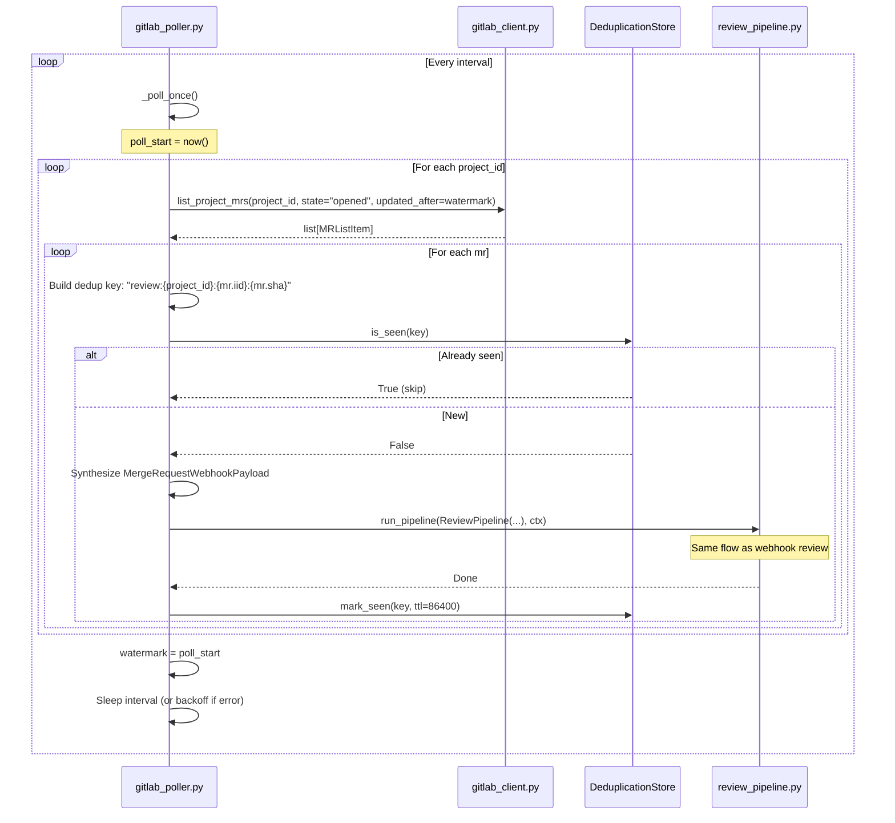
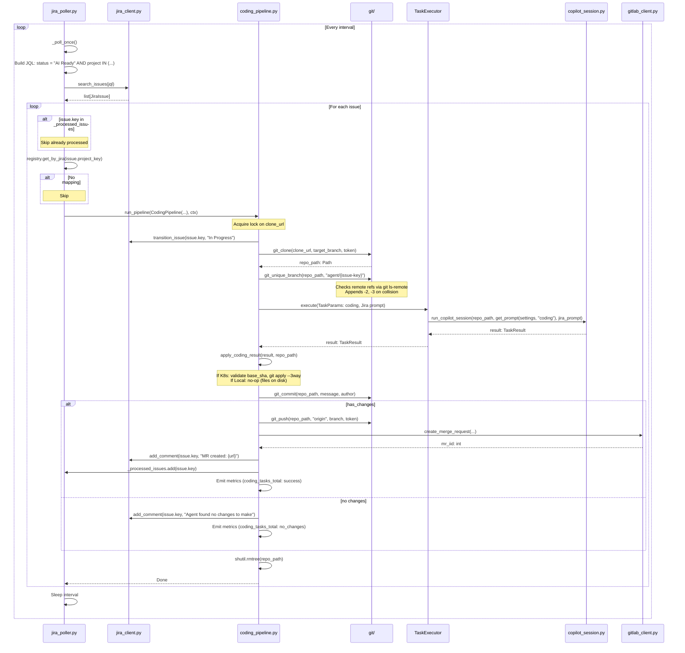

# Request Flows

End-to-end data flows with sequence diagrams for each major operation.

---

## 1. Webhook MR Review

Triggered when GitLab sends `merge_request` webhook with action `open`, `update` (with new commits), or `reopen`.

```mermaid
sequenceDiagram
    participant GL as GitLab
    participant WH as gitlab_webhook.py
    participant RPIPE as review_pipeline.py
    participant GLCL as gitlab_client.py
    participant CREG as credential_registry.py
    participant EXEC as TaskExecutor
    participant COP as copilot_session.py
    participant SDK as Copilot SDK
    participant PARSE as comment_parser.py
    participant POST as comment_poster.py
    
    GL->>WH: POST /webhook (X-Gitlab-Token header)
    WH->>WH: _validate_webhook_token() (HMAC)
    alt Invalid token
        WH-->>GL: 401 Unauthorized
    end
    
    WH->>WH: Parse MergeRequestWebhookPayload
    WH->>WH: Check project allowlist
    WH->>WH: Check action in HANDLED_ACTIONS
    WH->>WH: Check oldrev (skip if None)
    WH->>WH: Check DeduplicationService (skip if seen)
    
    WH->>WH: Add _process_review to background_tasks
    WH-->>GL: 200 {"status": "queued"}
    
    Note over WH,POST: Background task starts
    
    WH->>RPIPE: run_pipeline(ReviewPipeline(...), ctx)
    RPIPE->>GLCL: clone_repo(git_http_url, source_branch, token)
    GLCL->>GLCL: git.clone.git_clone()
    GLCL-->>RPIPE: repo_path: Path
    
    RPIPE->>GLCL: list_mr_discussions(project_id, mr_iid)
    GLCL-->>RPIPE: list[Discussion]
    
    RPIPE->>CREG: resolve_identity(credential_ref, gitlab_url)
    Note over CREG: GET /user (cached per credential)
    CREG-->>RPIPE: AgentIdentity (user_id, username)
    
    RPIPE->>RPIPE: Build DiscussionHistory(discussions, agent)
    
    RPIPE->>RPIPE: extract_last_reviewed_sha(discussion_history)
    alt SHA marker found
        RPIPE->>GLCL: compare_commits(project_id, last_reviewed_sha, head_sha)
        GLCL-->>RPIPE: incremental changes (diff since last review)
    else No marker (first review / post-deploy / failed post)
        Note over RPIPE: Use full MR diff
    end
    
    Note over RPIPE: build_review_prompt() renders<br/>prior feedback + outdated annotations<br/>+ suppressed feedback (human-resolved/dismissed) into prompt
    
    RPIPE->>EXEC: execute(TaskParams: review)
    alt LocalTaskExecutor
        EXEC->>COP: run_copilot_session(repo_path, prompts)
        COP->>SDK: CopilotClient.create_session()
        COP->>SDK: session.send({"prompt": user_prompt})
        SDK-->>COP: assistant.message events
        COP-->>EXEC: raw_review: str
    else RemoteTaskExecutor
        EXEC->>EXEC: create_namespaced_job()
        Note over EXEC: Job runs task_runner.py
        EXEC->>EXEC: _wait_for_result (poll Redis)
        EXEC-->>EXEC: result from Redis
    end
    EXEC-->>RPIPE: raw_review: TaskResult
    
    RPIPE->>PARSE: parse_review(raw_review)
    PARSE-->>RPIPE: ParsedReview (comments, resolutions, summary)
    
    RPIPE->>GLCL: get_mr_details(project_id, mr_iid)
    GLCL-->>RPIPE: MRDetails (diff_refs, changes)
    
    RPIPE->>POST: post_review(gl, project_id, mr_iid, diff_refs, parsed, changes, resolution_behavior, head_sha)
    POST->>POST: _parse_hunk_lines() for all changes
    loop For each comment
        POST->>POST: _is_valid_position()
        alt Valid position
            POST->>GL: mr.discussions.create() (inline)
        else Invalid position
            POST->>GL: mr.notes.create() (fallback)
        end
    end
    alt Has resolutions & behavior != "off"
        loop For each resolution
            alt auto-resolve & status=resolved
                POST->>GL: disc.notes.create() (✅ ack)
                POST->>GL: disc.resolved = True; disc.save()
            else suggest & status in (resolved, partial)
                POST->>GL: disc.notes.create() (✅/⚠️ ack)
            end
        end
    end
    POST->>GL: mr.notes.create() (summary + SHA marker)
    POST-->>RPIPE: Done
    
    RPIPE->>GLCL: cleanup(repo_path)
    RPIPE->>RPIPE: Mark (project_id, mr_iid, head_sha) as reviewed
    RPIPE->>RPIPE: Emit metrics (reviews_total, reviews_duration)
```

**Error Handling**:
- On exception in background task: log, emit `webhook_errors_total`, post failure comment to MR, re-raise
- Cleanup: `repo_path` removed in finally block

**Suppressed Feedback Flow** (Feature 7):
1. `build_review_prompt()` calls `_format_suppressed_feedback(discussion_history)`
2. For each inline discussion authored by the agent:
   - If `_is_human_resolved(disc, agent_user_id)` → tagged `[MANUALLY RESOLVED]` (discussion resolved by a non-agent user, detected via `resolved_by_id` field)
   - Else if `_is_dismissed(disc, agent_user_id)` → tagged `[DISMISSED]` (developer replied with a dismissal phrase matching `_DISMISSAL_PATTERNS`)
3. Qualifying items rendered under `## Suppressed Feedback (Do Not Re-Raise)` prompt section
4. Section omitted entirely when no items qualify
5. LLM instructed via `_SUPPRESSED_FEEDBACK_RULES` to never re-raise listed items

---

## 2. Webhook Discussion Interaction (Unified Thread Handler)

Triggered when GitLab sends a `note` webhook for an MR comment that @mentions the agent (e.g., `@copilot-agent please add tests`).

```mermaid
sequenceDiagram
    participant GL as GitLab
    participant WH as gitlab_webhook.py
    participant DPIPE as discussion_pipeline.py
    participant DE as discussion_engine.py
    participant GLCL as gitlab_client.py
    participant EXEC as TaskExecutor
    participant GIT as git/

    GL->>WH: POST /webhook (note event)
    WH->>WH: _validate_webhook_token()
    WH->>WH: Parse NoteWebhookPayload
    WH->>WH: Check noteable_type == "MergeRequest"
    WH->>WH: Resolve AgentIdentity (credential_registry)
    WH->>WH: Skip if user.id == agent_identity.user_id (self)
    WH->>WH: _is_agent_directed(payload, agent_identity)
    alt Not @mentioned
        WH-->>GL: 200 {"status": "ignored"}
    end
    WH->>WH: Add _process_discussion to background_tasks
    WH-->>GL: 200 {"status": "queued"}

    Note over WH,GIT: Background task starts

    WH->>DPIPE: run_pipeline(DiscussionPipeline(...), ctx)
    alt repo_locks provided
        DPIPE->>DPIPE: async with repo_locks.acquire(git_http_url)
    end

    DPIPE->>GLCL: clone_repo(git_http_url, source_branch, token)
    GLCL-->>DPIPE: repo_path: Path

    DPIPE->>GLCL: get_mr_details(project_id, mr_iid)
    GLCL-->>DPIPE: MRDetails
    DPIPE->>GLCL: list_mr_discussions(project_id, mr_iid)
    GLCL-->>DPIPE: list[Discussion]
    DPIPE->>DPIPE: Build DiscussionHistory + find triggering discussion

    DPIPE->>DE: build_discussion_prompt(mr_details, discussion_history, triggering)
    DE-->>DPIPE: user_prompt: str
    DPIPE->>DE: run_discussion(executor, settings, repo_path, ..., user_prompt)
    DE->>EXEC: execute(TaskParams: coding, prompt)
    EXEC-->>DE: result: TaskResult
    DE-->>DPIPE: result: TaskResult
    DPIPE->>DE: parse_discussion_response(result.summary)
    DE-->>DPIPE: DiscussionResponse (reply, has_code_changes, resolution)

    alt has_code_changes
        DPIPE->>DPIPE: apply_coding_result(result, repo_path)
        DPIPE->>GIT: git_commit(repo_path, message, author)
        alt has_changes
            DPIPE->>GIT: git_push(repo_path, "origin", source_branch, token)
        end
    end

    DPIPE->>GL: discussion.notes.create({"body": reply})
    alt response.resolution & behavior != "off"
        alt auto-resolve & status=resolved
            DPIPE->>GL: disc.resolved = True; disc.save()
        end
    end
    DPIPE->>DPIPE: shutil.rmtree(repo_path)
```

**Error Handling**:
- On exception: log, emit `webhook_errors_total` with label `handler="discussion"`, post "❌ Error processing discussion" comment, re-raise
- Cleanup: `repo_path` removed in finally block

---

## 3. Poller @mention Note Discovery

Background poller discovers @mention notes on open MRs.

```mermaid
sequenceDiagram
    participant POLL as gitlab_poller.py
    participant GLCL as gitlab_client.py
    participant DEDUP as DeduplicationStore
    participant DPIPE as discussion_pipeline.py
    
    loop For each project_id
        POLL->>GLCL: list_project_mrs(project_id, state="opened", updated_after=watermark)
        GLCL-->>POLL: list[MRListItem]
        
        loop For each mr
            POLL->>GLCL: list_mr_notes(project_id, mr.iid, created_after=watermark)
            GLCL-->>POLL: list[NoteListItem]
            
            loop For each note
                alt note.system
                    Note over POLL: Skip system notes
                end
                POLL->>POLL: Check @mention pattern match
                alt Not @mentioned
                    Note over POLL: Skip
                end
                POLL->>POLL: Check agent_identity.user_id (skip self)
                POLL->>POLL: Build dedup key: "note:{project_id}:{mr.iid}:{note.id}"
                POLL->>DEDUP: is_seen(key)
                alt Already seen
                    DEDUP-->>POLL: True (skip)
                else New
                    DEDUP-->>POLL: False
                    POLL->>POLL: Synthesize NoteWebhookPayload
                    POLL->>DPIPE: run_pipeline(DiscussionPipeline(...), ctx)
                    Note over DPIPE: Same flow as webhook discussion handler
                    DPIPE-->>POLL: Done
                    POLL->>DEDUP: mark_seen(key, ttl=86400)
                end
            end
        end
    end
```

**Dedup Key**: `note:{project_id}:{mr_iid}:{note.id}` (TTL: 24 hours)

**Self-Comment Guard**: If agent identity matches note author, skip processing (prevents infinite loop).

---

## 4. GitLab Poller MR Discovery

Background poller discovers new/updated MRs via GitLab API.

```mermaid
sequenceDiagram
    participant POLL as gitlab_poller.py
    participant GLCL as gitlab_client.py
    participant DEDUP as DeduplicationStore
    participant RPIPE as review_pipeline.py
    
    loop Every interval
        POLL->>POLL: _poll_once()
        Note over POLL: poll_start = now()
        
        loop For each project_id
            POLL->>GLCL: list_project_mrs(project_id, state="opened", updated_after=watermark)
            GLCL-->>POLL: list[MRListItem]
            
            loop For each mr
                POLL->>POLL: Build dedup key: "review:{project_id}:{mr.iid}:{mr.sha}"
                POLL->>DEDUP: is_seen(key)
                alt Already seen
                    DEDUP-->>POLL: True (skip)
                else New
                    DEDUP-->>POLL: False
                    POLL->>POLL: Synthesize MergeRequestWebhookPayload
                    POLL->>RPIPE: run_pipeline(ReviewPipeline(...), ctx)
                    Note over RPIPE: Same flow as webhook review
                    RPIPE-->>POLL: Done
                    POLL->>DEDUP: mark_seen(key, ttl=86400)
                end
            end
        end
        
        POLL->>POLL: watermark = poll_start
        POLL->>POLL: Sleep interval (or backoff if error)
    end
```

**Watermark Strategy**:
- `_watermark` initialized to `now()` on first start (avoids replaying historical notes)
- Updated to poll cycle start time after all projects processed
- `updated_after` filter ensures only MRs updated since last cycle are returned

**Dedup Key**: `review:{project_id}:{mr_iid}:{mr_sha}` (TTL: 24 hours)

**Error Handling**:
- On exception in `_poll_once()`: log, increment `_failures`, exponential backoff (max 300s)
- Successful cycle: reset `_failures` to 0

---

---

## 5. Jira Poller Coding Task

Background poller discovers Jira issues in "AI Ready" status.

```mermaid
sequenceDiagram
    participant POLL as jira_poller.py
    participant JCL as jira_client.py
    participant CPIPE as coding_pipeline.py
    participant GIT as git/
    participant EXEC as TaskExecutor
    participant COP as copilot_session.py
    participant GLCL as gitlab_client.py
    
    loop Every interval
        POLL->>POLL: _poll_once()
        POLL->>POLL: Build JQL: status = "AI Ready" AND project IN (...)
        POLL->>JCL: search_issues(jql)
        JCL-->>POLL: list[JiraIssue]
        
        loop For each issue
            alt issue.key in _processed_issues
                Note over POLL: Skip already processed
            end
            
            POLL->>POLL: registry.get_by_jira(issue.project_key)
            alt No mapping
                Note over POLL: Skip
            end
            
            POLL->>CPIPE: run_pipeline(CodingPipeline(...), ctx)
            
            Note over CPIPE: Acquire lock on clone_url
            
            CPIPE->>JCL: transition_issue(issue.key, "In Progress")
            CPIPE->>GIT: git_clone(clone_url, target_branch, token)
            GIT-->>CPIPE: repo_path: Path
            
            CPIPE->>GIT: git_unique_branch(repo_path, "agent/{issue-key}")
            Note over GIT: Checks remote refs via git ls-remote<br/>Appends -2, -3 on collision
            
            CPIPE->>EXEC: execute(TaskParams: coding, Jira prompt)
            EXEC->>COP: run_copilot_session(repo_path, get_prompt(settings, "coding"), jira_prompt)
            COP-->>EXEC: result: TaskResult
            EXEC-->>CPIPE: result: TaskResult
            
            CPIPE->>CPIPE: apply_coding_result(result, repo_path)
            Note over CPIPE: If K8s: validate base_sha, git apply --3way<br/>If Local: no-op (files on disk)
            
            CPIPE->>GIT: git_commit(repo_path, message, author)
            alt has_changes
                CPIPE->>GIT: git_push(repo_path, "origin", branch, token)
                CPIPE->>GLCL: create_merge_request(...)
                GLCL-->>CPIPE: mr_iid: int
                CPIPE->>JCL: add_comment(issue.key, "MR created: {url}")
                CPIPE->>POLL: _processed_issues.add(issue.key)
                CPIPE->>CPIPE: Emit metrics (coding_tasks_total: success)
            else no changes
                CPIPE->>JCL: add_comment(issue.key, "Agent found no changes to make")
                CPIPE->>CPIPE: Emit metrics (coding_tasks_total: no_changes)
            end
            
            CPIPE->>CPIPE: shutil.rmtree(repo_path)
            CPIPE-->>POLL: Done
        end
        
        POLL->>POLL: Sleep interval
    end
```

**Processed Tracker**: In-memory set of processed issue keys (cleared on service restart or hot-reload).

**Locking**: `asyncio.Lock` around `_poll_once()` prevents races during hot-reload. Per-repo lock on `clone_url` prevents concurrent clone/push operations.

**Error Handling**:
- On exception: log, emit `coding_tasks_total` with outcome=error, post failure comment to Jira, re-raise
- Cleanup: `repo_path` removed in finally block

---

## Error Handling Patterns

### Webhook Background Tasks
- Exception logged with `aexception()` (includes stack trace)
- Metrics emitted: `webhook_errors_total` with label `handler="review"` or `handler="copilot_comment"`
- Failure comment posted to MR (best effort, secondary exception logged but swallowed)
- Exception re-raised (captured by FastAPI, returns 500 to webhook sender only if still in request context)

### Poller Tasks
- Exception logged with `aexception()`
- Failure counter incremented: `_failures += 1`
- Exponential backoff: `sleep(min(interval * 2**failures, 300))`
- Successful cycle resets `_failures = 0`

### Git Operations
- Token sanitized in error messages (replaced with `***`)
- Timeout enforced (120s for clone, 60s for other ops)
- Cleanup on error: `shutil.rmtree(tmp_dir, ignore_errors=True)` in clone

### Task Execution
- LocalTaskExecutor: exceptions propagate to caller
- RemoteTaskExecutor:
  - Job timeout: delete Job, raise TimeoutError
  - Job failure: read pod logs, delete Job, raise RuntimeError with logs
  - Redis unavailable: exception propagates

### Copilot Session
- Timeout enforced via `asyncio.wait_for(done.wait(), timeout=timeout)`
- Session destroyed in finally block
- CLI path validation (raises if binary not found)

---

## Sequence Diagram Legend

- **Solid arrow (`->>`)**: Synchronous call or message
- **Dashed arrow (`-->>`)**: Return value or response
- **Alt block**: Conditional branching
- **Loop block**: Iteration
- **Note**: Clarifying comment

---

## Performance Characteristics

| Flow | Latency | Bottleneck | Parallelism |
|------|---------|-----------|-------------|
| Webhook MR review | 30-120s | Copilot SDK session | None (sequential: clone → review → post) |
| Webhook discussion (@mention) | 30-120s | Copilot SDK session | Per-repo lock (serializes concurrent requests on same MR) |
| GitLab poller (MR) | Poll interval + review latency | GitLab API rate limits | Sequential per project |
| GitLab poller (notes) | Poll interval + command latency | GitLab API rate limits | Sequential per project |
| Jira poller | Poll interval + coding latency | Jira API rate limits | Sequential per issue, per-repo lock |

**Copilot Session Timeout**: Default 300s (5 minutes), configurable per-call.

**GitLab API Rate Limits**: python-gitlab client retries on 429, respects Retry-After header.
