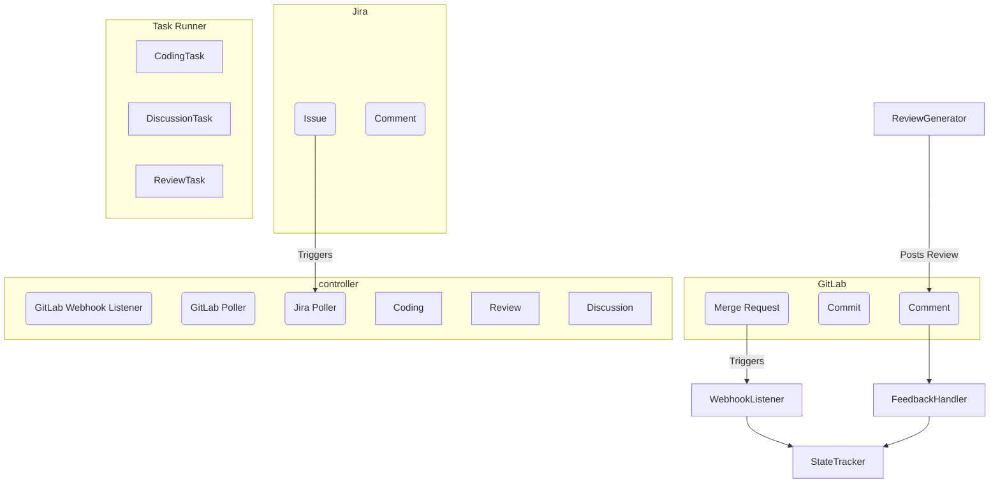

```mermaid
graph TD
  subgraph "GitLab"
    MR(Merge Request)
    Commit(Commit)
    Comment(Comment)
  end
  subgraph "Jira"
    Issue(Issue)
    IssueComment(Comment)
  end
  subgraph "controller"
    GitLabWebhookListener(GitLab Webhook Listener)
    GitLabPoller(GitLab Poller)
    JiraPoller(Jira Poller)
    Coding
    Review
    Discussion
  end

  subgraph "Task Runner"
    CodingTask
    DiscussionTask
    ReviewTask
  end

  Issue -->|Triggers| JiraPoller

  MR -->|Triggers| WebhookListener
  WebhookListener --> StateTracker
  ReviewGenerator -->|Posts Review| Comment
  Comment --> FeedbackHandler
  FeedbackHandler --> StateTracker
```